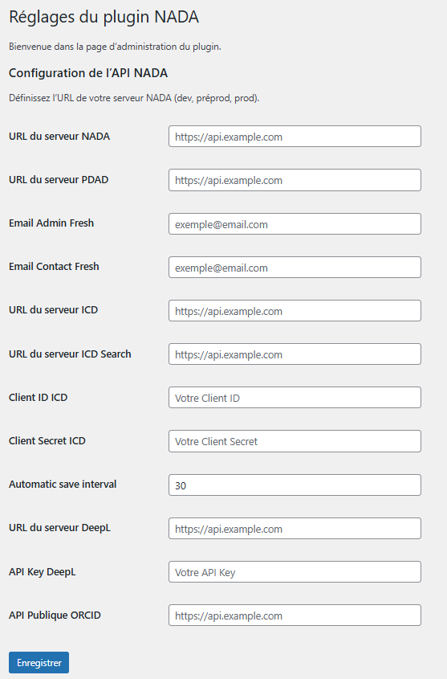
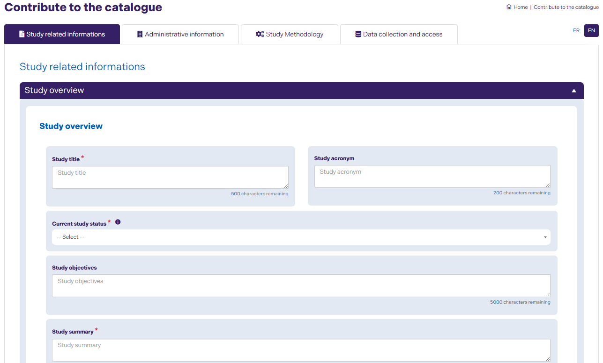
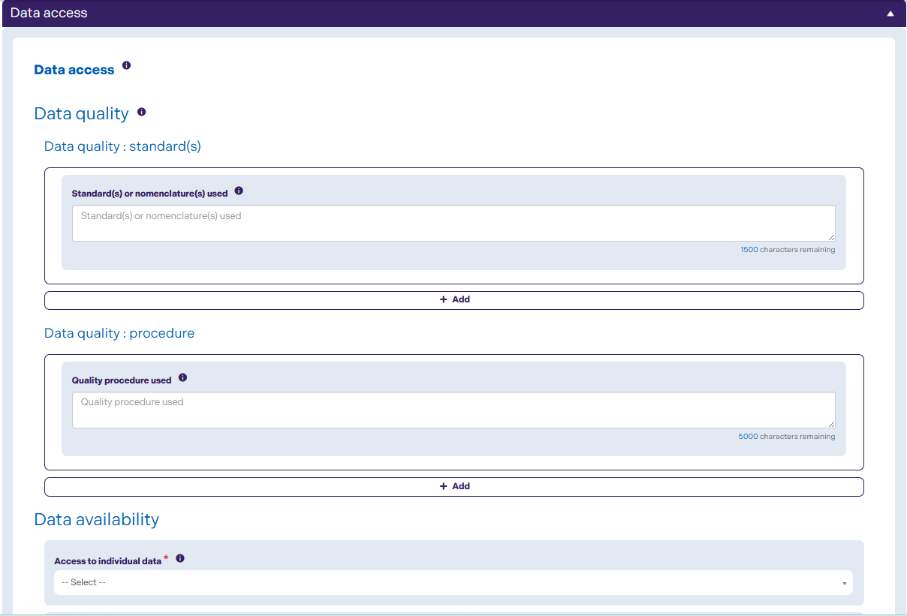
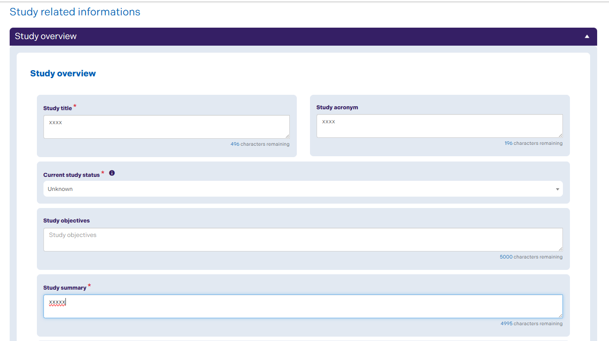
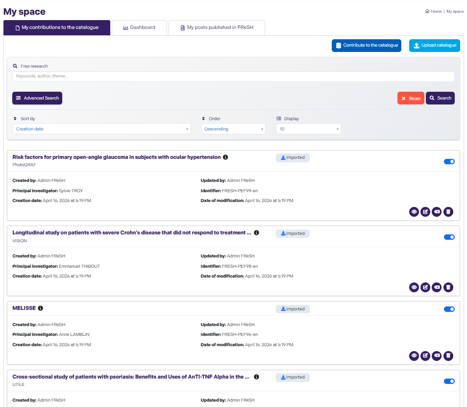
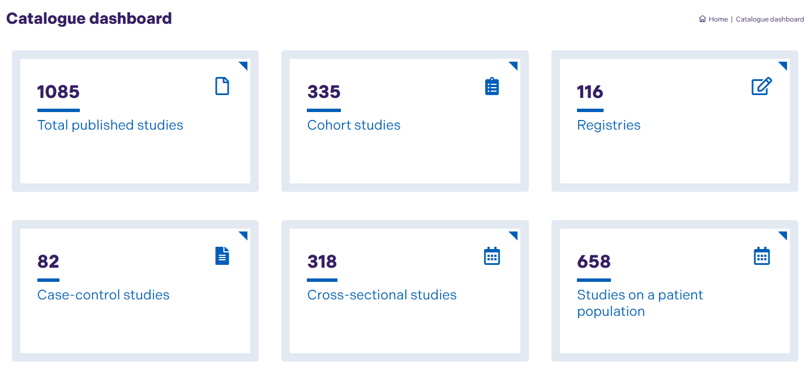
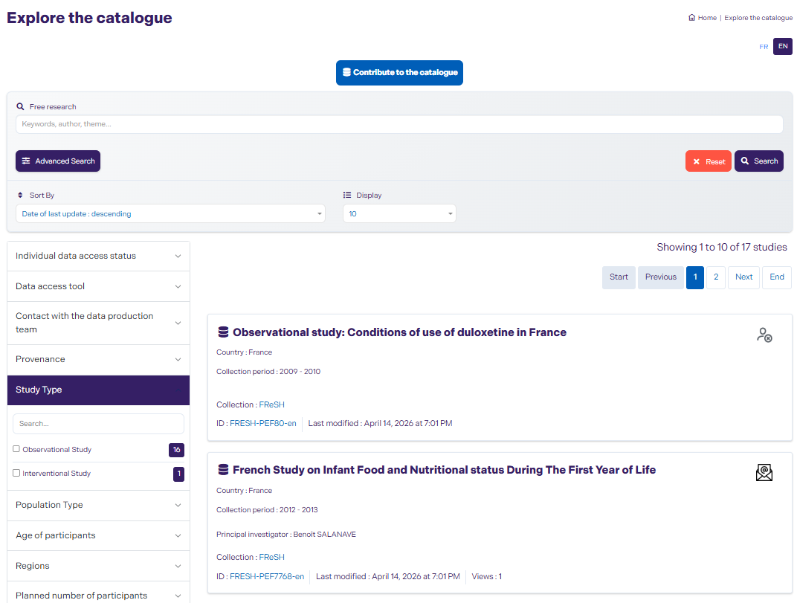

## NADA-ID

NADA-ID is a WordPress plugin designed to facilitate the management of studies (datasets) based on the NADA (National Data Archive) standard.


---

## Description

The plugin primarily allows users to create, upload, edit, and structure studies through:

- **dynamic forms**
- **repeater fields**
- an **intelligent auto-fill feature**
- **study file import**
- **sending emails to relevant users**
- **study version management**

The goal is to simplify metadata entry while ensuring compliance with the standards used in data archives.

👉 Official NADA Documentation
https://ihsn.github.io/nada-documentation/intro/#why-nada

---

## Informations

- **Name** : NADA-ID 
- **Version** : 2.3.2  
- **Type** : WordPress Plugin

---

## Objectives

- Cenralize study management within WordPress
- Ensure compliance with **NADA** standards
- Reduce data entry errors through **auto-fill**
- Provide **assisted editing**
- Manage **complex fields dynamically**
- Improve user productivity

---

## Key Features

### Study Creation & Editing

- Full form for creating studies
- Edit mode with **automatic data pre-fill**

### Dynamic Repeater

- Add/remove dynamic blocks
- Multi-language synchronization

### Intelligent Auto-Fill

- Automatically inject data into form fields
- Supports structured JSON data
- Handles dependent fields

### Conditional Fields

- Dynamic display based on user input
- Supports `select`, `textarea`, and more

### Version control management

- A study may contain multiple versions.
- Change tracking

### Automatic saving

- Automatic saving of studies every 30 seconds
- Configurable interval based on requirements
- Reduced risk of data loss
- Improved user experience during data entry

### NADA Compatibility

- Structure compliant with **NADA 5.4** requirements
- Facilitates archiving and interoperability

### Personalized user space

NADA-ID provides a dedicated user space allowing each user to access studies based on their role and permissions.

Each user can only view the studies relevant to them:
- Administrators (role: **Admin_Fresh**): full access to all studies
- Contributors: access to their own studies
- PIs: restricted access based on defined permissions

### Easily explore published studies

NADA-ID provides a dedicated page to browse all published study catalogs, designed to offer a smooth and efficient experience.

- Search by multiple criteria
- Faceted filtering
- Language filtering
- Dynamic results for quick access

### DeepL Translation

- Integration of DeepL for content translation
- Fast, high-quality translation of study fields
- Support for main languages (FR / EN and others depending on DeepL configuration)
- Synchronization of translated content across different language versions

### Change detection between studies (parent & versions)

- Automatic comparison between the parent study and its different versions
- Detection of changes at the field, value, and structure levels
- Highlighting differences to facilitate tracking of changes

### Multi-language Support

- Manage data per language (FR, EN)
- Automatic fallback

---

## NADA API Extensions

In addition to the APIs provided by NADA, custom endpoints have been added to meet the specific needs of the project.

### Custom Endpoints

- **Retrieve statistics**  
  `api/catalog/dashboard_stats`

- **Advanced catalog search**  
  `api/catalog/advanced_search`

- **Retrieve facets**  
  `api/catalog/filters_ID`

- **Autocomplete search**  
  `/api/catalog/autocomplete`

- **Retrieve the ID of the last added study**  
  `api/catalog/last_survey_id`

- **Retrieve datasets based on the connected user role**  
  `api/datasets/user_datasets`

- **Bulk delete datasets**  
  `api/datasets/delete_many`

---

## Technologies

- WordPress >= 6.x
- PHP >= 8.2
- jQuery

---

## Requirements

- PHP >= 8.2
- WordPress ≥ 6.x

## Installation

1. Clone the repository:
git clone https://github.com/<repository-url>
2. Copy it into: /wp-content/plugins/ or upload it via the WordPress admin panel
3. Activate the plugin from the WordPress interface
4. Access the iD module from the WordPress admin dashboard

---

## Usage

1. Create a new study
2. Fill in dynamic forms
3. Add repeater fields if necessary
4. Use auto-fill to speed up data entry
5. Save and manage study versions

---

## Configuration:



---

## Dependencies

- WordPress
- NADA standard (metadata structure)
- Polylang plugin

---

## Project structure

```md
nada-id/
│── admin/
│── includes/
│── public/
│── languages/
│── README.md
```

---

## Architecture

The plugin follows a clear separation of concerns:

- Backend: business logic (PHP)
- Frontend: templates / UI
- Dynamic: JavaScript (jQuery)

---

## Shortcodes

- `[nada_id_add_study]` → Study creation and editing form
- `[nada_id_list_catalogs]` → Catalog list
- `[nada_id_list_studies]` → Personalized user space
- `[nada_id_study_details]` → Study details
- `[nada_id_upload_v1]` → Study upload
- `[nada_id_list_referentiel]` → Repository management management
- `[nada_id_referentiel_details]` → Repository Details
- `[nada_statistics]` → User space dashboard
- `[nada_catalog_statistics]` → Catalog dashboard
- `[variable_dictionary]` → Field dictionary and controlled vocabulary dictionary

---

## Preview

### Study Creation Form



### Dynamic Repeater



### Auto-fill in Edit Mode



### My space


### Catalog dashboard


### Explore the catalog


---

## Usage Example

### Create a Contribution Page

1. Go to Catalogue → Contribute
2. Add the shortcode:

```text
[nada_add_study_shortcode]
```

---

## Performance

Scripts and styles are loaded only when the corresponding shortcodes are used.

---

## API Integration

The plugin can consume external data sources for:

- ORCID
- Deepl
- ICD

---

## Security

- User input validation
- Protection against unauthorized access
- Compliance with WordPress best practices

---

## Troubleshooting

- Fields are not populated
  - Ensure the DOM is fully loaded
  - Check jQuery selectors
- `Select` fields do not trigger updates
  - Ensure `.trigger("change")` is used

## Authors

- IMPACT HEALTHCARE

## Licence

MIT