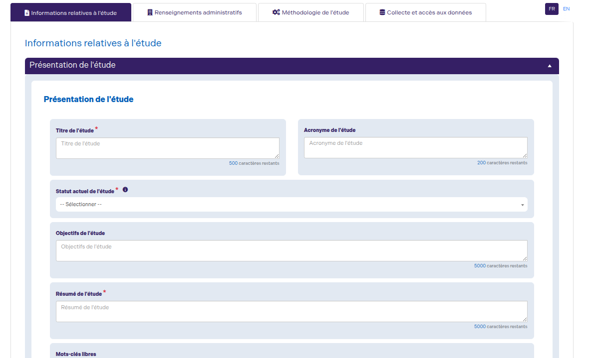
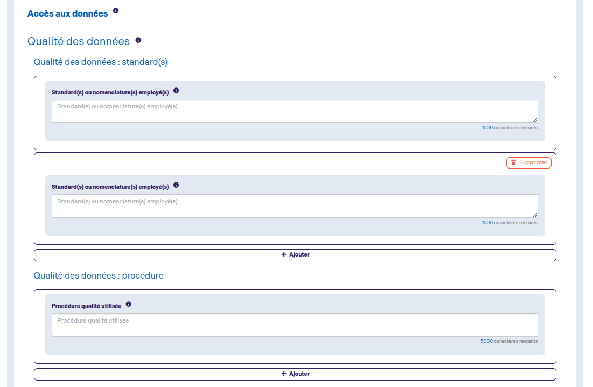
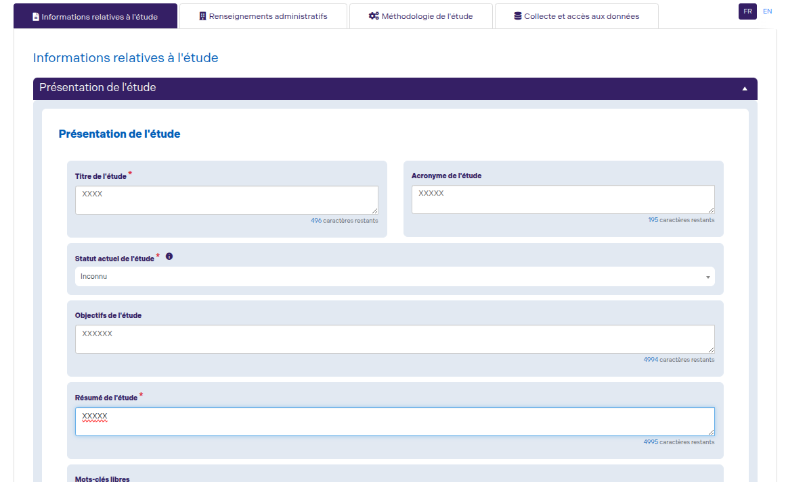
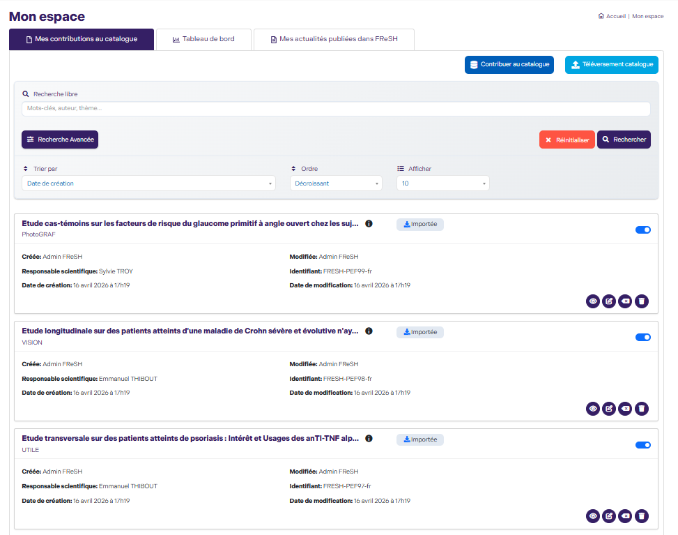
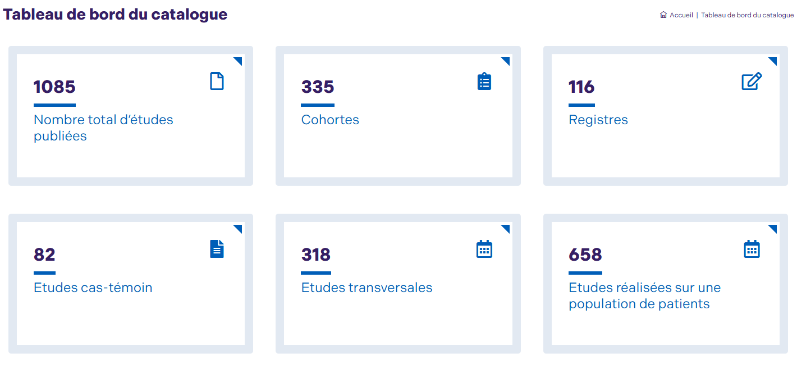
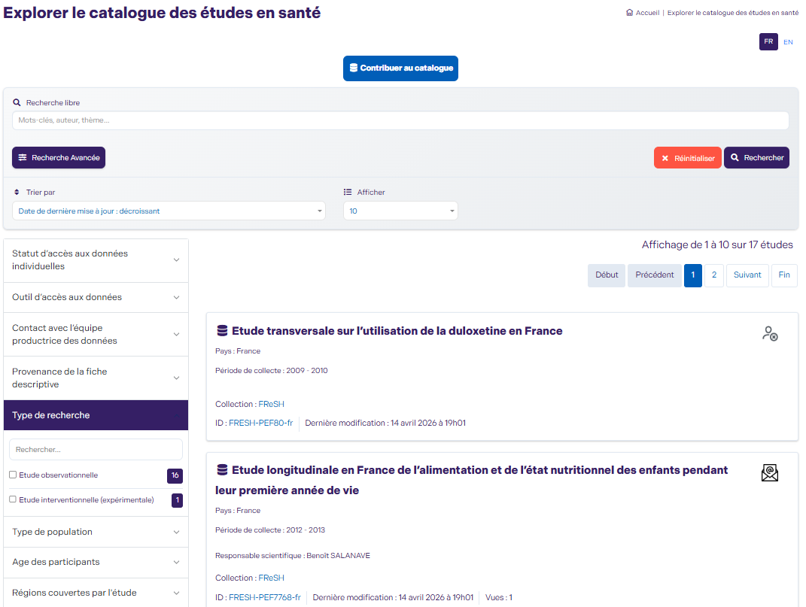

## NADA-ID

NADA-ID est un plugin WordPress conçu pour faciliter la gestion des études (datasets) en s’appuyant sur le standard **NADA (National Data Archive)**.


---

## Description

Le plugin permet principalement de créer, Téléverser, modifier et structurer des études à travers :

- des **formulaires dynamiques**
- des **champs répéteurs**
- une **fonctionnalité intelligente d’auto-remplissage**
- l’**importation de fichiers d’études**
- l’**envoi d’emails aux utilisateurs concernés**
- la **gestion des versions des études**

L’objectif est de simplifier la saisie des métadonnées tout en assurant leur conformité avec les standards utilisés dans les archives de données.

👉 Documentation officielle NADA :  
https://ihsn.github.io/nada-documentation/intro/#why-nada

---

## Informations

- **Nom** : NADA-ID  
- **Version** : 2.3.2  
- **Type** : Plugin WordPress  

---

## Objectifs

- Centraliser la gestion des études dans WordPress
- Assurer la conformité avec les standards **NADA**
- Réduire les erreurs de saisie grâce à l’**auto-remplissage**
- Fournir une **édition assistée**
- Gérer des **champs complexes de manière dynamique**
- Améliorer la productivité des utilisateurs

---

## Fonctionnalités principales

### Création & édition d’études

- Formulaire complet de création
- Mode édition avec **pré-remplissage automatique**

### Répéteurs dynamiques

- Ajout/suppression de blocs dynamiques
- Synchronisation multi-langue

### Auto-remplissage intelligent

- Injection automatique de données
- Support des structures JSON
- Gestion des champs dépendants

### Champs conditionnels

- Affichage dynamique selon les entrées utilisateur
- Support de différents types (`select`, `textarea`, etc.)

### Gestion du versioning

- Une étude peut contenir plusieurs versions
- Suivi des modifications

### Sauvegarde automatique

- Sauvegarde automatique des études toutes les 30 secondes
- Intervalle configurable selon les besoins
- Réduction des risques de perte de données
- Amélioration de l’expérience utilisateur lors de la saisie

### Compatibilité NADA

- Structure conforme aux exigences **NADA 5.4**
- Facilite l’archivage et l’interopérabilité

### Espace utilisateur personnalisé

NADA-ID propose un espace utilisateur dédié permettant à chaque utilisateur d’accéder aux études selon son rôle et ses autorisations.

Chaque utilisateur visualise uniquement les études qui le concernent :
- Administrateurs(role: **Admin_Fresh**) : accès complet à toutes les études
- Contributeurs : accès à leurs propres études
- PIs : accès restreint selon les permissions définies

### Explorez facilement les études publiées

NADA-ID met à disposition une page dédiée pour parcourir l’ensemble des catalogues d’études publiés, pensée pour offrir une expérience fluide et efficace.

- Recherche par plusieurs critéres
- Filtrage par facets
- Filtrage par langue
- Résultats dynamiques pour une un accès rapide

### Traduction deepl

- Intégration de DeepL pour la traduction des contenus
- Traduction rapide et de haute qualité des champs d’étude
- Support des langues principales (FR / EN et autres selon configuration DeepL)
- Synchronisation des contenus traduits entre les différentes versions linguistiques

### Détection des changements entre études (parent & versions)

- Comparaison automatique entre l’étude parent et ses différentes versions
- Détection des modifications au niveau des champs, valeurs et structures
- Mise en évidence des différences pour faciliter le suivi des évolutions

### Support multi-langue

- Gestion FR / EN
- Fallback automatique

---

## Extensions de l’API NADA

En complément des APIs fournies par NADA, des endpoints personnalisés ont été ajoutés pour répondre aux besoins spécifiques du projet.

### Endpoints personnalisés

- **Récupération des statistiques**  
  `api/catalog/dashboard_stats`

- **Recherche avancée du catalogue**  
  `api/catalog/advanced_search`

- **Récupération des facettes**  
  `api/catalog/filters_ID`

- **Recherche avec autocomplétion**  
  `/api/catalog/autocomplete`

- **Récupérer l’ID de la dernière étude ajoutée**  
  `api/catalog/last_survey_id`

- **Récupérer les datasets selon le rôle connecté**  
  `api/datasets/user_datasets`

- **Suppression multiple de datasets**  
  `api/datasets/delete_many`

---

## Technologies

- WordPress >= 6.x
- PHP >= 8.2
- jQuery

---

## Prérequis

- PHP ≥ 8.2
- WordPress ≥ 6.x

---

## Installation

1. Cloner le dépôt :
   ```bash
   git clone https://github.com/<repository-url>
2. Copier dans :  /wp-content/plugins/ ou téléverser a partir back-office
3. Activer le plugin depuis l’interface WordPress
4. Accéder au module iD depuis le back-office

---

## Utilisation

1. Créer une nouvelle étude
2. Remplir les formulaires dynamiques
3. Ajouter des champs répéteurs si nécessaire
4. Profiter de l’auto-remplissage pour accélérer la saisie
5. Sauvegarder et gérer les versions des études

---

## Configuration


---

## Dépendances

- WordPress
- Standard NADA (structure des métadonnées)
- Plugin polylang

---

## Structure du projet

```md
nada-id/
│── admin/
│── includes/
│── public/
│── languages/
│── README.md
```

---

## Architecture

Le plugin suit une séparation claire des responsabilités :

- Backend : logique métier (PHP)
- Frontend : templates / UI
- Dynamique : JavaScript (jQuery)

---

## Shortcodes

- `[nada_id_add_study]` → Formulaire de création et modification d’étude
- `[nada_id_list_catalogs]` → Liste du catalogue
- `[nada_id_list_studies]` → Espace utilisateur personnalisé
- `[nada_id_study_details]` → Détails d’une étude
- `[nada_id_upload_v1]` → Téléversement d’une étude
- `[nada_id_list_referentiel]` → List des référentiels
- `[nada_id_referentiel_details]` → Détails d'un référentiel
- `[nada_statistics]` → Tableau de bord du mon espace
- `[nada_catalog_statistics]` → Tableau de bord du catalogue
- `[variable_dictionary]` → Dictionnaire des champs et du vocabulaire contrôlé

---

## Aperçu

### Formulaire de création d’étude



### Répéteur dynamique



### Auto-remplissage en mode édition



### Mon espace


### Tableau de board du catalogue


### Explore le catalogue

 
---

## Exemple d’utilisation

### Créer une page de contribution

1. Aller dans Catalogue → Contribuer
2. Ajouter le shortcode :

```text
[nada_add_study_shortcode]
```

---

## Performance

Les scripts et styles sont chargés uniquement lorsque les shortcodes correspondants sont utilisés.

---

## API Integration

Le plugin peut consommer des services externes comme :

- ORCID
- Deepl
- ICD

---

## Sécurité

- Validation des entrées utilisateur
- Protection contre les accès non autorisés
- Respect des bonnes pratiques WordPress

---

## Dépannage

- Les champs ne sont pas remplis
  - Vérifier le chargement du DOM
  - Vérifier les sélecteurs jQuery
- Les champs `select` ne déclenchent pas de mise à jour
  - Vérifier l’utilisation de `.trigger("change")`

---

## Auteurs

- IMPACT HEALTHCARE

## Licence

MIT
